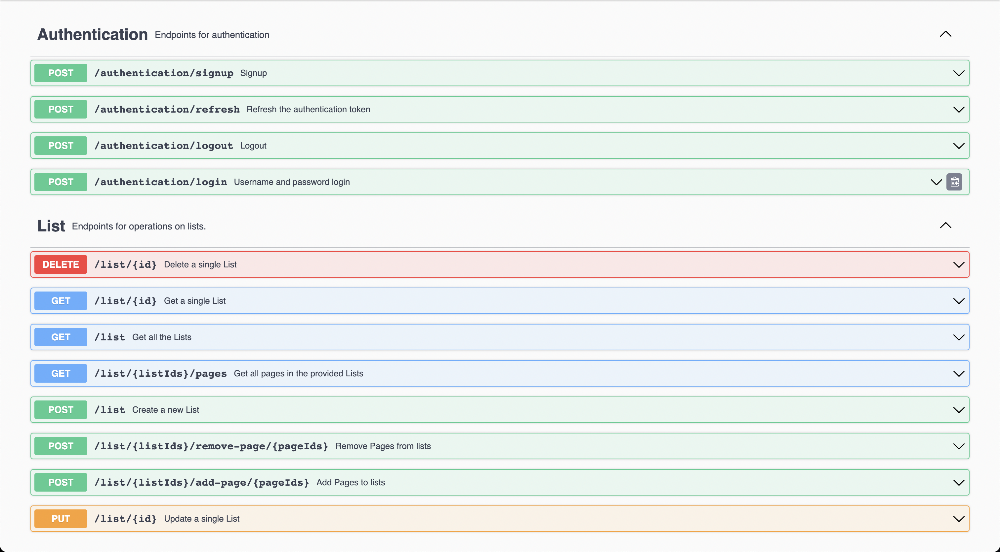

# Pin Board
Pin Board is a self-hosted, open source, service that makes possible to save, manage, and read articles you’ve found on the internet later.

## Why Pin Board?
If you find yourself bombarded with cute videos and lolcats all day, Pin Board might help you save those for later.
If you frequently come across things you'd like to read "at some time" then Pin Board can, again, help you out.

## Prerequisite
In order to make the service works the following are needed.

### Snapshot version
If you want to use the snapshot version (i.e. simply use the service from the _main_ branch):
* [JDK 19+](https://openjdk.org/)
* [MySQL](https://www.mysql.com/)

### Release version
If you want to use the release version (i.e. simply use the service from one of the _release-X_ branches):
* [Docker](https://www.docker.com/)

## How to run

### Snapshot version
* Be sure to have the `mysql` database up and running
* Run the following command in the terminal
  `./mvnw spring-boot:run`

### Release version
* Run the following command in the terminal
  `docker-compose -f deployment/docker-compose.yml up -d`

## Configuration
The `.env` file contains the system configuration. An example of content is the following:
```
MYSQL_HOST=db
MYSQL_PORT=3306
MYSQL_USERNAME=root
MYSQL_PSW=root
JWT_SECRET=thisIsVerySecret
JWT_EXP=1
MYSQL_ROOT_PASSWORD=root
MYSQL_DATABASE=bootdb
CACHE_TTL=86400
CACHE_HOST=cache
CACHE_PORT=6379
```
Change the properties values according to your system.

## Documentation
After a successful [run](#how-to-run) of the system, the swagger UI will be available at `http://localhost:8085/api/swagger-ui/index.html`


## Client [coming soon]
It's possible to use the system via rest-api simply by using this repository, which hosts the backend.
Visit the [provided client](https://github.com/MDeLuise/pin-board-client) repository to use the service via web app.

## Contributing
Fell free to contribute! Just a few useful information below.

This project use the Trunk-Based Development as source-control branching model. The usual workflow for contributing is the following:

1. create a new branch starting from main branch,
1. work on that,
1. create a pull request to merge the branch in the main. 

Once the pull request is approved, please rebase the branch upon `main`. Once the pull request will be accepted, the commits will be squashed using the pull request's description, so please provide a meaningful description message.